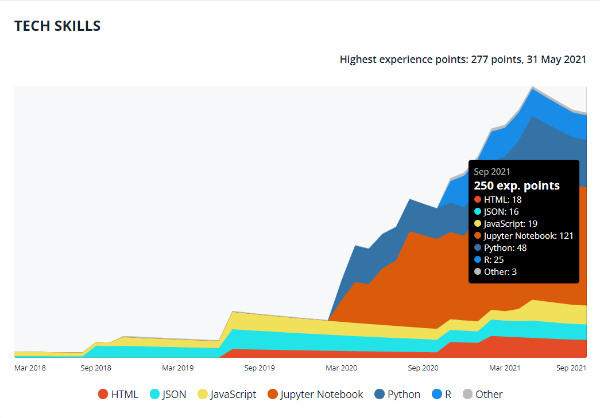

<!-- Banner picture -->
<!--

-->

---
<h1 align="center"> Hi there, I'm Maeva Ralafiarindaza 👋</h1>

    
    
    
    
    
    

I am data engineer of origin from Madagascar. 

<!--
I am a logic-driven person, passionate about working with data and technology to solve problems, to help people make informed decisions, and to understand how things work.

Having worked with computer networks, databases, and reportings for years, I wanted to understand more about how we could use data and technologies to discover opportunities for solving problems. This has led me to pursue Data Engineering, Data Science, and Machine Learning.

I am looking forward to digging deeper into this vast field.
-->

- 🌱 I'm currently learning Advanced SQL, Graph Databases, Power BI, Machine Learning techniques, and working on a VS Code Extension
- 👯 I’'m looking to collaborate on Kaggle projects and on building helpful data tools
- 😄 Pronouns: He/Him/His
- ⚡ Fun fact: I like to spend time playing my guitar and piano, sometimes doing recordings of cover songs and posting them on YouTube.
- 📫 How to connect with me:

    
    
    
    
    
    

<!--Github Stats-->

<figure align="center">
    
    
</figure>
<!-- Tech Skills CodersRank -->
<figure align="center">
    
    <figcaption style="color: #ccc;">
        Powered by <a href="https://profile.codersrank.io/user/maevadevs" style="color: #aaa;">codersrank.io</a>
    </figcaption>
</figure>
